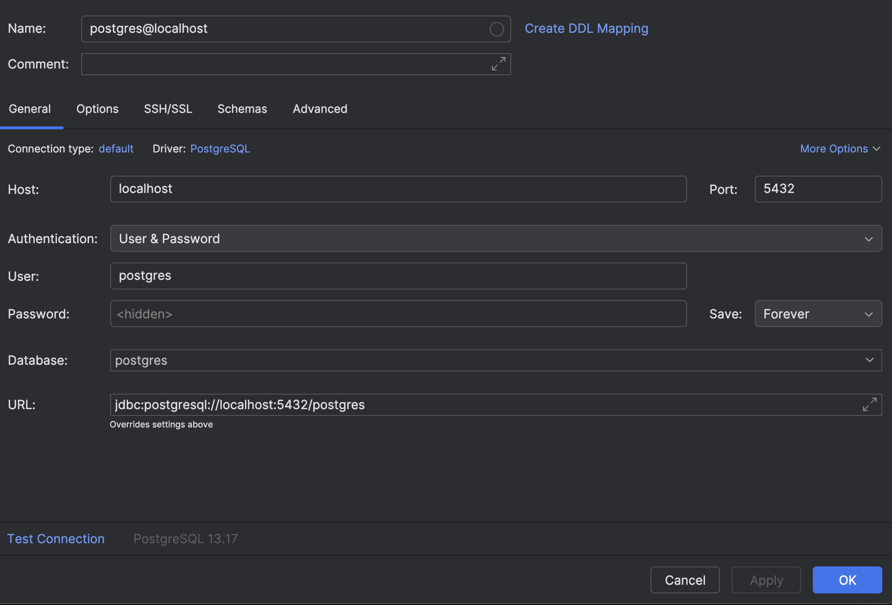
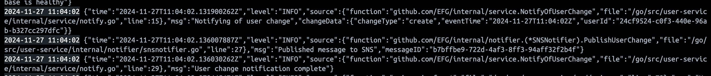

# user-service project

## Architecture

This application relies on some integrations (mainly to a datasource and a notifier). To handle these the architecture implemented allows for these to be injected either mocked or real (a simple form of dependency injection through the use of [Go's Interfaces](https://go.dev/tour/methods/9)). Each dependency is fronted by an abstract interface that is then subsequently implemented by the real or mocked service. This allows for an easy swap out of real services with mocked ones for running locally or in Pre-Production/Production environments, as well as not tying the underlying deeper level implementation that is tied technologies and possibly vendors to bleed into pure application logic that should have no concern with that level of detail. 

The entry point into the `user-service` is a gRPC API implemented in the `internal/server` package. The main `server` struct in this package is used in main to inject the relevant datasource and notifier dependencies. These will then passed via the different handlers for each endpoint in the API.

 The handlers here will delegate work for the respective actions called via the API to the `user service` core logic, which lives in `internal/service`. Here the processing of data from API requests is transformed and then orchestration for the reading/writing/notifying is set using the relevant interfaces to interact with the underlying implementations (either real or mocked) to conduct unit and integration testing, as well as be used by the real initialised application when running so that it can take requests from the client server and perform the expected actions with relevant responses via the API.

## Running the app

### Without mocks inside Docker

To run the application within docker compose, there is a loaded Makefile that has all the commands required. The main command will be: 

```sh
make fresh
```
This will stop any running user service containers if applicable, and then build the user service image with the 'latest' image tag. The produced image is built based on the `Dockerfile` and this is then run within the docker compose network along side a Postgres database and flyway migrations. 

To interact with the gRPC api a client server has been configured and be can be run as a local process on your machine, found at `cmd/client/client.go` just running `go run client.go` will do the job. This file can be changed and run in real time to see changed reflect through the API and database in the docker compose network. 

To connect to the database to see the data persisted using your favourite db workbench, you can connect to the postgres instance using the config found in the image below. Important to note that it will connect through localhost you may have noticed that the docker compose config needs the container name explicitly since they are on the same docker network the user service will connect slightly differently.



To get the notifier running: 

I have setup the 'real' notifier to be an SNS topic, that is controlled through Infrastructure As Code 'IAC' in the root `terraform` folder. The main.tf here is mocked to feed into localstack as standard. So after running 
```sh
make fresh
```
if you wish to use the SNS topic the following dependencies are required: 
[tflocal install](https://docs.localstack.cloud/user-guide/integrations/terraform/#using-the-tflocal-script) and [awslocal install](https://docs.localstack.cloud/user-guide/integrations/aws-cli/#localstack-aws-cli-awslocal)

after installing them running the following ""inside"" the root `terraform` folder will bring the SNS topic to life in docker: 

`tflocal init`
`tflocal apply -auto-approve`

With the notifier the default setup is a no-op object. To turn on the 'real' notifier in this case an SNS topic, the following the env vars will need to be set in the docker compose yaml file for the user service container. There is a validation check on the AWS config struct that gets loaded through the env package to confirm that a working set of env vars are available.
      - AWS_ACCESS_KEY_ID=test
      - AWS_SECRET_ACCESS_KEY=test
      - AWS_LOCALSTACK_URL=http://localstack:4566
      - AWS_REGION=eu-west-2
      - AWS_USER_CHANGE_NOTIFICATION_TOPIC=arn:aws:sns:eu-west-2:000000000000:user_change_notification

## Database Migrations

### Locally

As mentioned above the docker compose file consists of several key services to have the application running locally, the two main services for playing around with flyway locally is 'db' and 'flyway'. Running `docker compose up db flyway` will do the trick and allow you to see the migrations be applied through the output. 

> Note: all of this is automatically handled by running `make fresh`


### How are the migrations structured

You may have noticed that we have a root 'db' folder that exists within the project, this is where the migrations live - currently inside that db folder there is a sub folder 'migrations'. Since we point flyway to the 'db' folder in general it has access the sub folder and thats important because it allows it to not only run change scripts linked to pure migrations, but create and updated functions as the same time, for us to use within the application code.

The naming convention for the migrations sub folder: 

**Versioned migrations** have a  *version* , a *description* and a  *checksum* . The version must be unique. The description is purely informative for you to be able to remember what each migration does. The checksum is there to detect accidental changes. Versioned migrations are the most common type of migration. They are applied in order exactly once.

It is important to note that are other types of naming conventions and sub folders that can be utilised by flyway to help better set up the database: 

**Undo migrations** are the opposite of regular versioned migrations. An undo migration is responsible for undoing the effects of the versioned migration with the same version. Undo migrations are optional and not required to run regular versioned migrations.

**Repeatable migrations** have a description and a checksum, but no version. Instead of being run just once, they are (re-)applied every time their checksum changes.

This is very useful for managing database objects whose definition can then simply be maintained in a single file in version control. They are typically used for (Re-)creating views/procedures/functions etc.

> Note: A decent caveat for the repeatable migrations which you may be wondering as to why the functions in the user-service are being create via versioned migrations. Is that more complex objects can bleed into each other depending on how statements are built inside them. To avoid this you can sue versioned migrations to help split apart the creation of these objects. It also means that the objects will not try to be recreated every time a flyway migration is ran

## Running the tests

There are two main testing suites around the codebase, units tests will live in each respective package in the `internal` folder these can be run without any concern at any point. 

The integration test suite which lives in the `integrationtest` folder at root required the services to be alive in Docker to be able to run so `make fresh` will have to have been before and the containers are running docker to be able to run those.

## Decisions

### Project structure

The architecture diagram illustrates how the application is divided into modular building blocks. Each package is designed to encapsulate specific logic, and where appropriate, interfaces are provided to abstract this logic. This approach ensures:

1.	Ease of Iteration: New features can be developed or integrated quickly, whether by leveraging existing technologies or swapping out and adding new ones with minimal disruption.

2.	Decoupling: Core logic is isolated from its underlying implementations, reducing the risk of regressions and simplifying testing.

3.	Maintainability: The structure avoids cyclic dependencies, making the codebase easier to navigate and test.

The project does its best to adhere to a flat structure, aligning with Go’s philosophy of keeping project layouts simple and straightforward. By minimising nesting and avoiding convoluted sub-packages, this helps the project reduce complexity and mitigates risks associated with overly hierarchical/patterned designs.

### Datasource and relevant tooling

Although the current implementation of the datasource is Postgres, the datasource interface allows this to be switched out easily at any time without affecting the core logic in the `internal/` `server` and `service` packages. 

PostgreSQL provides a great balance in the relational database world. While it may not offer the same raw read throughput as MySQL, it does provide a richer feature set that can be leveraged easily for microservices.

PostgreSQL supports storing semi-structured data in JSONB columns, this offers the flexibility for scenarios where a hybrid structured and unstructured data approach is needed. This bridges some of the functionality associated with NoSQL dbs while retaining the consistency from relational models.
 
PostgreSQL has a decent sized open-source community that provides a wide range of extensions to be used.
 
Compared to even more feature rich alternatives like Oracle or MSSQl, PostgreSQL is open-source, which helps reduce license fees and potential vendor lock in contracts. PostgreSQL instances are available fully managed on cloud platforms like AWS, Azure, and GCP allowing for cheap use and scalability support.

I feel like a relational database like PostgreSQL suits a user management service, PostgreSQL ensures the reliability and atomicity of transactions, which is ideal for user related operations such as creation and password updates for example. Any data inconsistencies or schema issues could significantly impact the service.

The predefined schema itself enforces consistency and integrity, ensuring that data follows strict rules. This reduces the risk of malformed or incomplete data sets, which could be a problem for the schemaless NoSQL databases.
  
Since the schema is predefined, a relational database feels like a good choice for maintaining the contract while supporting structured data.

While NoSQL databases excel quite well in terms of flexibility and scalability, I feel these benefits are less relevant for this use case, where the idea of data consistency and rules to a fixed schema are better suited.

PostgreSQL can handle horizontal scaling for most use cases. The current datasource abstraction is designed to ensure easy swapping of the database if scaling needs change or alternatives appear to be better.

In an ideal scenario, database to database integrations with other teams would be avoided in favor of APIs or event-driven architectures. However, if such integrations are required, having the enforced schema helps with consistency across services. The schema also provides a foundation for validation of data passed to downstream systems, such as ETLs or data lakes like Snowflake, ensuring compatibility and reducing errors.

### API 

This was my first time using gRPC, and I took the opportunity to immerse myself in this and enjoy it. One aspect I really appreciated was how the spec is defined in the .proto file, providing a clear contract that can be neatly encapsulated within a package for use both internally and by the client. I like how this approach basically promotes clean and consistent communication between services.

Another feature I enjoyed was the simplicity of handling request and response shapes. With REST, you kind of need to ensure the correct JSON structures and responses for each endpoint, sometimes requiring additional handling even with tools like Gin, gRPC abstracts much of that complexity. So keeping that at bay without worrying about manually wrapping endpoints in handlers was a good boost.

The built in health checking server was great. It allowed for custom implementations to monitor critical paths and dependencies, making the process of setting and updating health statuses more streamlined as it’s integrated directly into the gRPC server.

One challenge I encountered during iterative development was ensuring that the client server setup was sending the required requests. With REST APIs, tools like Postman make it easy to simulate requests during development. For gRPC, I had to adjust my workflow to properly configure and test client server, although it was a great learning experience.

### Notifier

The notifier is set up as an abstraction similar to the datasource so in terms of how its aligns with the core application logic, the technology under the hood can be anything that suites it most. For the purpose of demonstration Ive created, a mock that is used in the test suite, a no-op which logs out for the user service and also an SNS specific set up. There are guidelines above in the run locally section about how to bring the SNS topic to life in docker and localstack to get that running and see the message ids returned from successful publishes in the logs i.e.



### Good practices

During the course of this project, I have placed emphasis on several key areas of design that align with good Go practices:
	•	Dependency Injection
	•	Separation of Concerns
	•	Interface Abstraction
	•	Minimal Global State

These principles form the foundational “building block” analogy I like to use when structuring a project. By keeping to these practices, the project remains naturally flat, easier to test, and mockable, this approach also enables developers to isolate specific chunks of code, improving accuracy and code coverage while reducing overall complexity.

By separating responsibilities across distinct modules and packages, and keeping interfaces as small as possible, the project minimizes cognitive complexity for developers. It also highlights key strategic way of thinking like:
A reader should not have write permissions. By keeping the tightness of scoped interfaces, the project reduces risks and enforces clear boundaries for anyone developing it further.

Interfaces are used to abstract dependencies, which allows for easier testing and mocking. This also keeps the system extensible, as implementation details can drastically change without affecting the core logic.

Minimising global state reduces the risk of unintended side effects. This is particularly important in environments like serverless functions, where global state can persist across invocations. By eliminating global variables, the project ensures that each execution starts from a clean state.

## For the future
Given some more TLC, there are several areas of the application I would love to enhance to increase it's functionality and robustness:

1.	Expanding the test suites:

    While the current test suites cover critical paths and assumes mainly happy-path scenarios, additional focus on edge cases and error scenarios would significantly improve the application’s resilience. Elaborating both unit and integration tests to account for these cases even more would help ensure better coverage. It would have been nice to set up a small HTTP server to subscribe to the SNS topic as well to ensure completeness for the notifier.

2.	Exploration of gRPC Streaming:

    The application currently does not leverage gRPC’s streaming abilities. It would have been fun to explore core features that could benefit from streaming, such as real-time data processing or long-lived client-server communication, to see gRPC’s full potential.

3.	Metrics and Observability:

    Given more time, I would identify key metrics to capture during the application’s process flow and operation. These metrics would aim to provide valuable insights into system performance, help measure how effectively the service delivers business value, allow us to detect trends (peak usage times). But mainly this data would be instrumental in helping the product team to drive decisions for feature development and optimising service performance to deliver impactful results as quick as possible.


